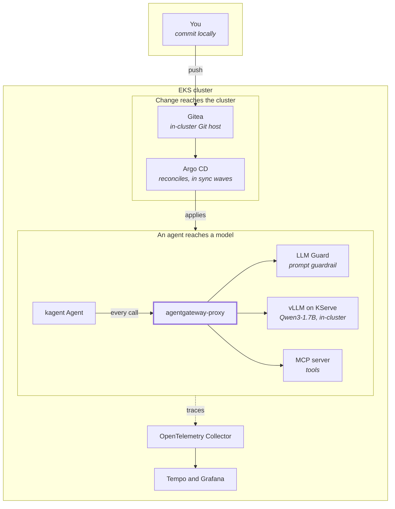

# Architecture

The settled architectural decisions, stated honestly. `reference/decisions.md` carries the dated log of how they were reached; this file is the current shape.

## The two paths that matter

Everything below is detail on these. The left path is how change reaches the cluster. The right
path is how an agent reaches a model, and it is the one most often drawn wrong.

The thick node is load-bearing. The agent talks only to the gateway, never to the model directly.
An agent that calls the model directly bypasses the guardrail and the audit policy, and the platform
then certifies controls that nothing traverses.
`tests/test_agentgateway_manifests.py::test_shipped_agents_route_inference_through_the_gateway`
asserts the `ModelConfig` `baseUrl` names the gateway.

## Platform

Amazon EKS, one cluster, managed control plane plus a T3 managed node group (2 to 3 t3.xlarge or t3.2xlarge workers). Kubernetes 1.35 or 1.36. vcluster is not used.

## Load balancing and ingress

The AWS Load Balancer Controller is the ingress and LB path: ALB for Ingress, NLB for Service type=LoadBalancer, Gateway API supported. Authenticate via EKS Pod Identity, one reusable scoped role rather than per-cluster IAM users.

MetalLB is not used. On EKS, AWS owns the load balancer and VIP layer, so MetalLB is decorative at best and conflicting at worst.

ingress-nginx is not used. It reached end of life on March 24, 2026, the repo is read-only with no security patches, and its planned successor InGate was abandoned. Platform ingress can route through kgateway and Gateway API to keep a vendor-neutral story, with the AWS Load Balancer Controller provisioning the NLB in front.

## Storage

The AWS EBS CSI driver provides PersistentVolumes for Prometheus, Loki, Tempo, and Grafana.

## Workload identity (IAM)

Every in-cluster workload that needs AWS permissions authenticates with EKS Pod Identity, not IRSA. This covers the AWS Load Balancer Controller and the EBS CSI driver. Pod Identity is the AWS-suggested default over IRSA as of July 2026, and at fleet scale it replaces 300 per-cluster OIDC trust policies with one reusable role plus a simple per-cluster association. The cluster sets `enable_irsa = false`, so no OIDC provider is created. The LB controller (a Helm chart deployed by ArgoCD) uses a standalone Pod Identity association; the EBS CSI driver (an EKS add-on) wires its association through the add-on's `pod_identity_association` so EKS owns the ordering. The Pod Identity agent add-on is installed on every cluster.

## GitOps and sync waves

ArgoCD reconciles everything from Git. Sync waves order the foundation so dependencies do not race: cert-manager and the AWS controllers first, then ingress and secrets tooling, then observability, then the Argo extensions, then Backstage last.

ArgoCD shards by cluster, not by app. With this component count on one cluster, all apps live in one shard, so controller sharding buys nothing. The repo server is the manifest-generation bottleneck; the HA default of two replicas is enough. The default kubectl parallelism limit of 20 is adequate. Bootstrap with server-side apply: the ApplicationSet and Argo Workflows CRDs exceed the client-side apply annotation limit.

## Demo agent model routing

The kagent demo agent reaches the in-cluster vLLM over an OpenAI-compatible endpoint, and it reaches it through agentgateway rather than directly, so the prompt-guard and audit policies on the gateway apply to it. There is no external API spend and no external credential in the default path.

Routing the agent through the gateway is the point rather than an implementation detail. An agent that calls the model directly bypasses every control the AI plane installs, and the platform then certifies guardrails nothing traverses. The `ModelConfig` `baseUrl` therefore names the gateway Service, and a test asserts it.

Swapping in a hosted model is a `ModelConfig` change: point `baseUrl` at the provider and supply the credential through External Secrets. Nothing else changes, because the agent only ever talks to the gateway.

## Observability and the AI plane

Every agent call, MCP invocation, and LLM request flows through OpenTelemetry to Tempo (traces) and Grafana (dashboards). OpenTelemetry GenAI semantic conventions are Development grade as of June 2026; `gen_ai.*` attributes are presented as current but unstable.
